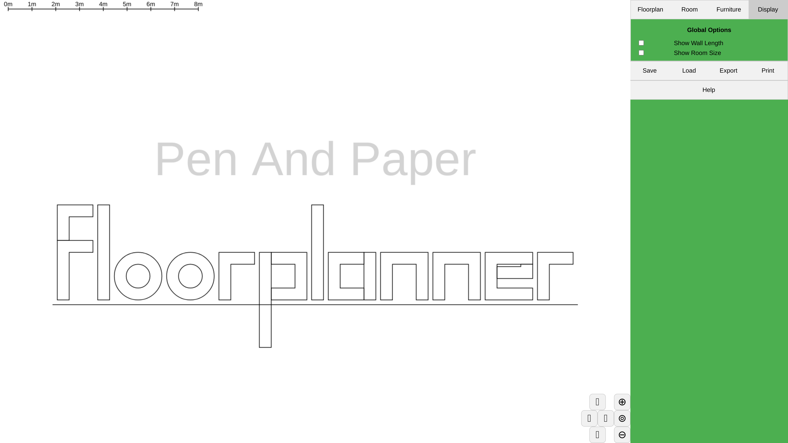
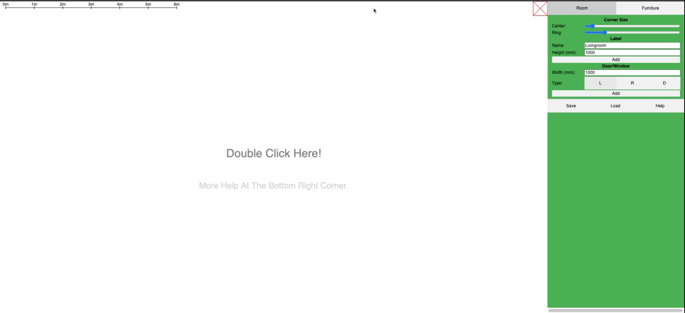
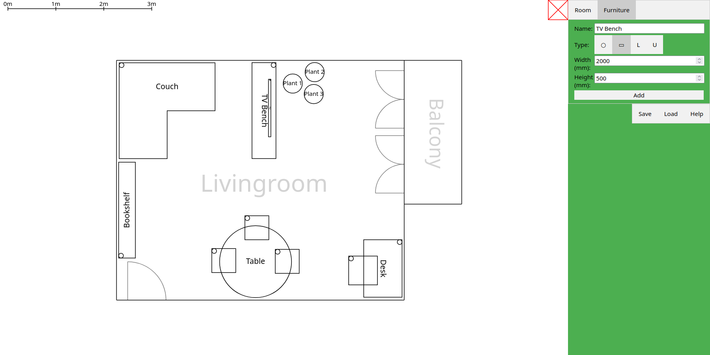

# Floorplanner

    

The Pen And Paper Floorplanner is an easy to use 2D floorplanner webapp with no overhead or registration.

[Try it online!](https://karldaeubel.github.io/PenAndPaperFloorplanner/)

## Features

- create floorplans by placing corners and walls
- add doors and windows
- give rooms a label
- place and rotate furniture of 4 different generic types
- load and save floorplans

# Screenshots

